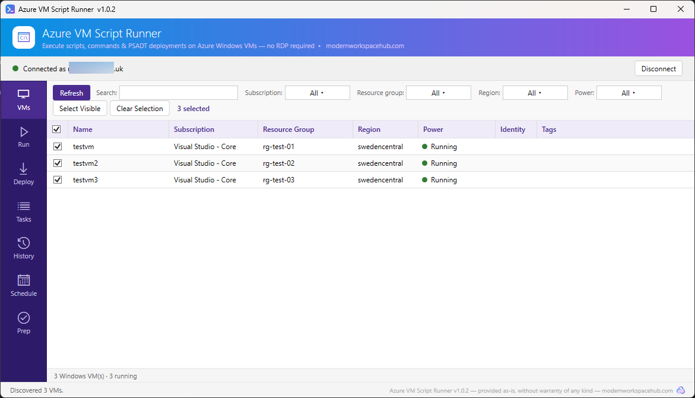
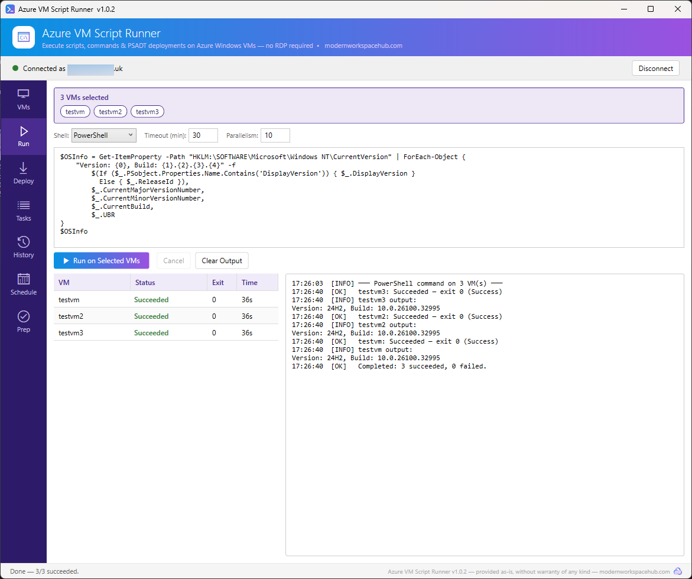
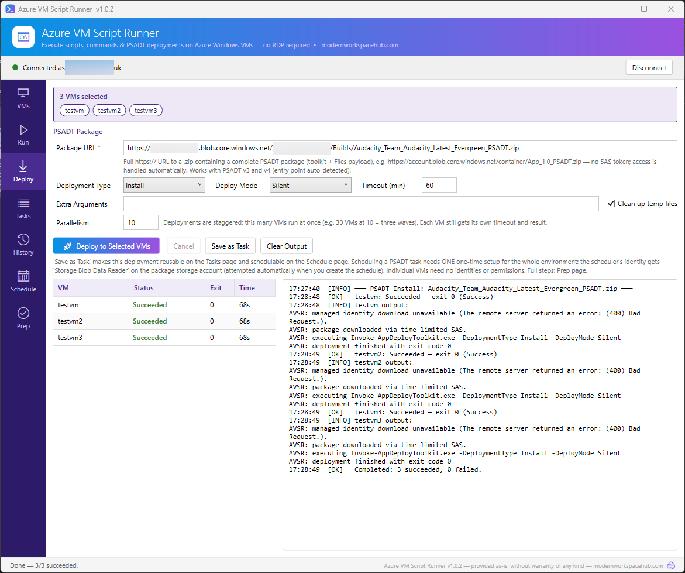
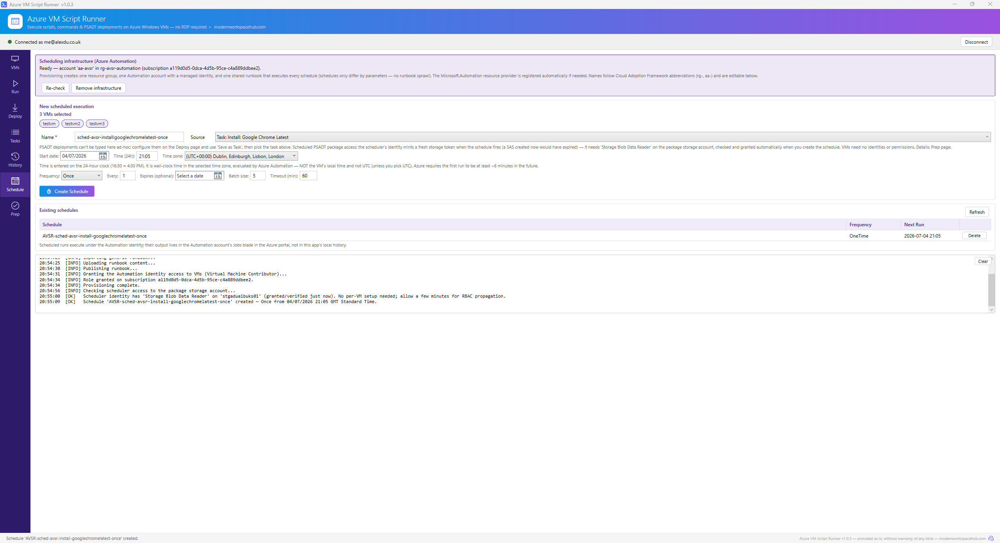
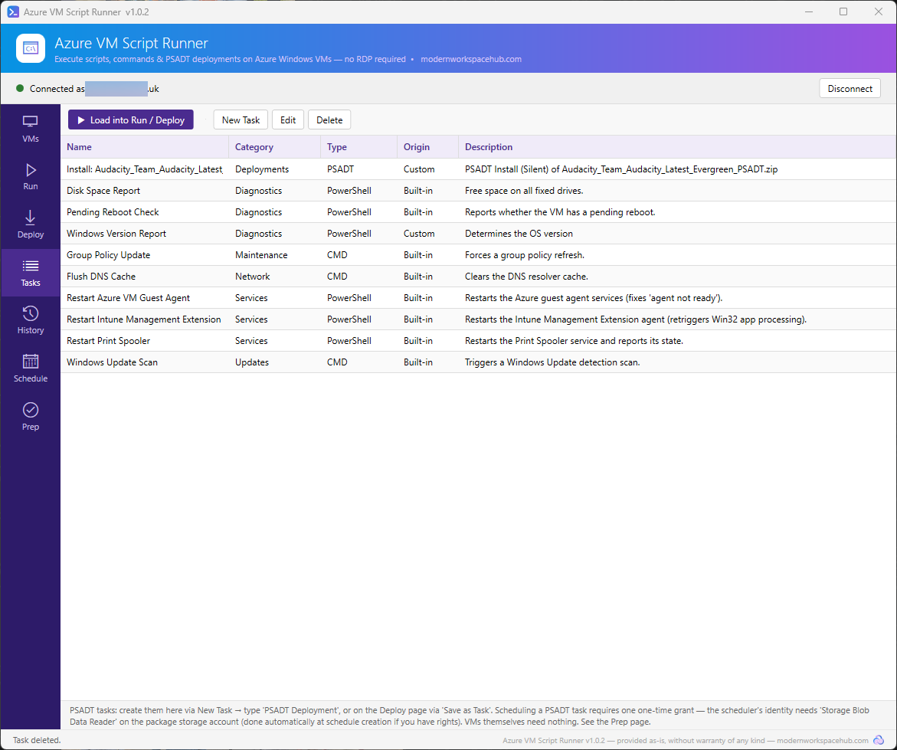
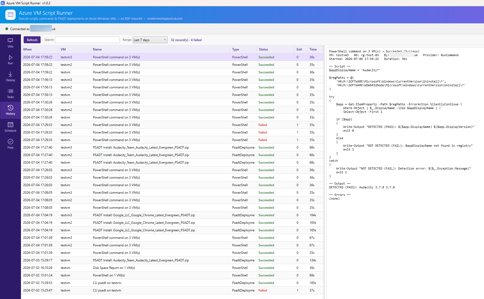
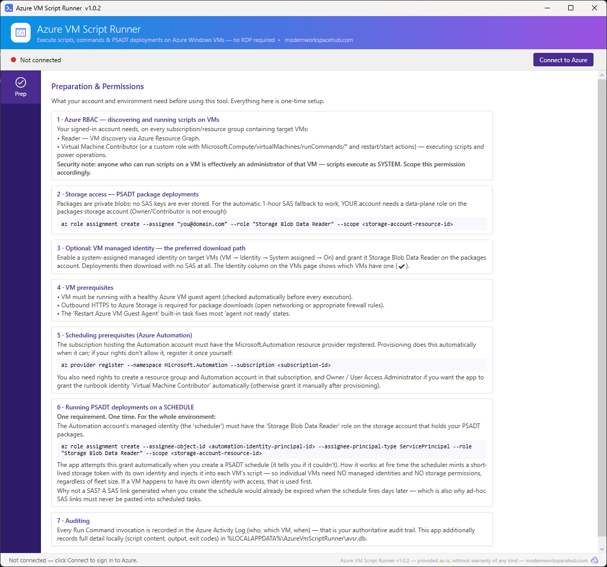
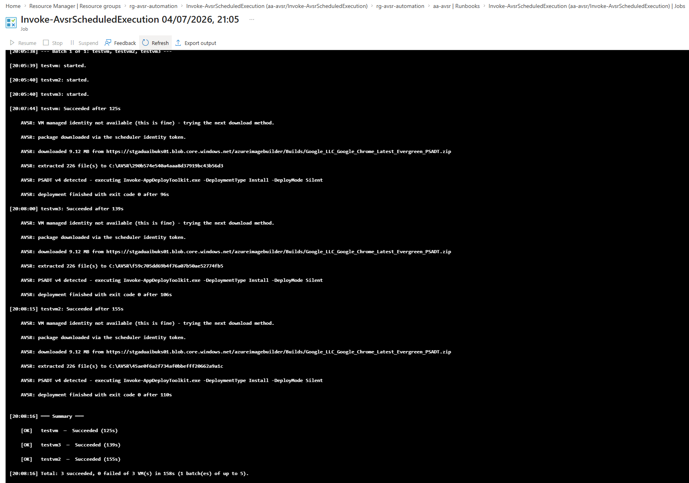

<p align="center">
  
</p>

<h1 align="center">Azure VM Script Runner</h1>

<p align="center">
  Execute scripts, commands &amp; PSADT deployments on Azure <strong>Windows</strong> VMs at scale, no RDP required.
</p>

<p align="center">
  <a href="../../releases"></a>
  <a href="LICENSE"></a>
</p>

---

> ⚠️ **Windows only.** This tool manages Azure **Windows** virtual machines exclusively. Linux VMs are filtered out of discovery and are not supported.
>
> ⚠️ **No warranty.** Provided free of charge, **as-is, without warranty of any kind**. Every execution runs as SYSTEM on the target VMs, and you are responsible for what you run and where. Test against non-production VMs first.
>
> Built and maintained by [modernworkspacehub.com](https://modernworkspacehub.com) · MIT licensed

## Why this exists

When something breaks at scale, waiting for your image pipeline is not an answer. This tool exists for the gap between *"we need this fixed on every VM now"* and *"the AIB build will be ready in a few hours"*:

- **A broken application on a live AVD estate.** An app update is causing issues across your session hosts. Rebuilding the golden image via Azure Image Builder and redeploying takes hours. Instead: build a PSADT package that uninstalls the bad version and installs the fixed one, select every affected host, deploy. Done in minutes, while the proper image fix follows at its own pace.
- **Disk expansions.** You've grown the managed disks in Azure, but the C: partition still needs extending inside every guest. Instead of RDPing into each VM: select them all and run one `Resize-Partition` script.
- **A critical Group Policy fix.** You've corrected a GPO that is causing live issues and can't wait for the refresh interval. Push `gpupdate /force` to the whole estate in one action.
- **Routine plumbing.** Restart a stuck service fleet-wide, check pending reboots, collect disk-space reports, restart the Intune Management Extension, fix "guest agent not ready" states.

Everything runs through Azure-native services (Resource Graph, Run Command, Azure Automation, Entra ID): no agents to install, no WinRM to open, no credentials stored anywhere.

## Screenshots

| VMs: discover & select | Run: execute at scale |
|---|---|
|  |  |

| Deploy: PSADT packages | Schedule: recurring executions |
|---|---|
|  |  |

| Tasks: reusable library | History: full audit detail |
|---|---|
|  |  |

| Prep: built-in setup guide | Scheduled run: Azure Automation job output |
|---|---|
|  |  |

## Features

- **Discovery**: every Windows VM across all your subscriptions in ~1 second via Azure Resource Graph, with Azure-portal-style multi-select filters (subscription, resource group, region, power state), free-text search, and bulk selection.
- **Run**: PowerShell or CMD against one or many VMs simultaneously, with configurable parallelism (VMs run in staggered waves), per-VM live status/exit codes/output, timeout, retry with backoff on Azure throttling, and cancellation that actually aborts the running script on the VM.
- **Deploy (PSADT)**: deploy [PSAppDeployToolkit](https://psappdeploytoolkit.com/) v3 & v4 packages from **private** Azure blob storage. No SAS tokens to manage: access uses the VM's managed identity when present, else a 1-hour SAS is auto-issued under your identity. Downloads, extracts, auto-detects the toolkit entry point, executes, classifies exit codes (0, 3010 "reboot required", 1602, PSADT 6xxxx…), cleans up.
- **Tasks**: an editable library of reusable tasks. Ships with 8 built-ins (GP update, flush DNS, restart Print Spooler / Intune Management Extension / Azure Guest Agent, Windows Update scan, pending-reboot check, disk-space report); add your own PowerShell/CMD/PSADT tasks.
- **Schedule**: recurring executions via Azure Automation (see [Scheduling](#scheduling) below for exactly what gets created).
- **History**: full local execution history: who ran what, on which VM, when, with complete script content, output, errors and classified exit codes. Searchable with date-range filters.
- **Safety rails**: every execution shows a confirmation listing *every* target VM; targeting more than 5 VMs adds a mass-operation warning; unhealthy VMs (deallocated, guest agent not ready) fail fast in preflight instead of burning timeouts.
- **Security**: interactive Entra ID sign-in every launch (deliberate; no ambient credentials), Azure RBAC end-to-end, nothing secret ever stored. The Azure Activity Log independently records every Run Command invocation.

## Install

1. Download `AzureVmScriptRunner_vX.Y.Z_win-x64.zip` from **[Releases](../../releases)**.
2. (Recommended) Verify the SHA256 against the hash in the release notes: `Get-FileHash .\AzureVmScriptRunner_vX.Y.Z_win-x64.zip`
3. Unzip anywhere and run **`AzureVmScriptRunner.exe`**.

It's fully portable and self-contained: no installer, no .NET runtime required, nothing written outside `%LOCALAPPDATA%\AzureVmScriptRunner`. Releases are unsigned (this is a free tool), so Windows SmartScreen may show an "unrecognised app" prompt on first run. *More info → Run anyway*, or unblock the zip before extracting (`Unblock-File`).

## Usage

1. **Connect**: click *Connect to Azure* and sign in with your Entra ID account (browser prompt, every launch, by design).
2. **Prep**: read this page first; it's the built-in setup guide covering everything in [Permissions](#permissions) below with copy-paste commands.
3. **VMs**: refresh discovery, filter/search, tick the VMs you want to target. The selection follows you to every other page, with each selected VM listed by name at the top so you can see exactly what you're about to hit.
4. **Run**: pick PowerShell or CMD, write your script, set timeout/parallelism, *Run on Selected VMs*, confirm the target list. Watch per-VM results and the live log.
5. **Deploy**: paste the blob URL of a zipped PSADT package (plain https URL, **no SAS token**), choose Install/Uninstall/Repair and deploy mode (Silent recommended, scripts run as SYSTEM in session 0), deploy. *Save as Task* makes it reusable.
6. **Tasks**: run anything from the library via *Load into Run / Deploy* (nothing executes directly from the Tasks page; you always review targets and confirm).
7. **Schedule**: provision the Automation infrastructure once (or adopt an existing one), then create schedules from saved tasks or ad-hoc PowerShell.
8. **History**: every Run/Deploy lands here automatically with full detail.

## Permissions

Your signed-in account needs, depending on what you use:

| Capability | Role needed | Scope | Notes |
|---|---|---|---|
| Discover VMs | `Reader` | Target subscriptions | Resource Graph honours your existing RBAC |
| Run scripts / deploy | `Virtual Machine Contributor` (or a custom role with `Microsoft.Compute/virtualMachines/runCommands/*`) | Target VMs / RGs / subscriptions | ⚠️ Scripts run as **SYSTEM**: anyone with this role effectively administers the VM |
| PSADT deployments (Run Now) | `Storage Blob Data Reader` | The storage account holding your packages | **Data-plane role**: being Owner/Contributor of the storage account is *not* sufficient |
| Provision scheduling | Rights to create a resource group + Automation account; `Owner`/`User Access Administrator` for automatic role grants (optional; grant manually otherwise) | The hosting subscription | The `Microsoft.Automation` resource provider is registered automatically if needed |

## Scheduling

**What happens when you schedule something:** the execution doesn't run from your machine. It's handed to Azure Automation, which fires it on the timer whether your workstation is on or not.

**Resources created** (one-time, in a subscription and region you choose; names, tags and identity are configurable before provisioning):

| Resource | Default name | Purpose |
|---|---|---|
| Resource group | `rg-avsr-automation` | Container for everything below; delete it to remove all traces |
| Automation account | `aa-avsr` | Runs scheduled jobs under its **managed identity** (Basic SKU; free tier covers 500 job-minutes/month) |
| Runbook (×1) | `Invoke-AvsrScheduledExecution` | One shared, generic runbook executes *every* schedule; schedules differ only by parameters. It is module-free and managed by the app; don't edit it |
| Schedules | `AVSR-<your name>` | One Schedule + JobSchedule pair per scheduled execution |

- **Recurrence** matches Azure natively: once / hourly / daily / weekly (specific days) / monthly (days of month, last day, or "second Tuesday"-style), time zones, intervals, expiry. Times are 24-hour, evaluated in the time zone you pick, not the VM's clock.
- **Identity**: by default a system-assigned managed identity is created with the account. **Bring your own**: paste the full resource ID of an existing user-assigned managed identity instead. Note its lifecycle (and eventual cleanup) is then yours.
- The identity gets `Virtual Machine Contributor` per target subscription (granted automatically when you have rights, otherwise the app tells you exactly what to grant).
- **Scheduled PSADT**: a SAS created today would be expired when the schedule fires, so instead the scheduler's identity mints a fresh short-lived storage token at fire time and passes it to each VM. One requirement, once, environment-wide: the scheduler identity needs `Storage Blob Data Reader` on the package storage account (checked and auto-granted at schedule creation). Individual VMs need **no** identities or permissions.
- **Multi-admin**: a colleague running the tool fresh auto-discovers your existing environment and can adopt it (after a deep validation: identity, runbook presence, published state, content match, roles) instead of creating a duplicate. Custom-named accounts are supported via *Show ALL Automation accounts*.
- **Job output** for scheduled runs lives in the Automation account's **Jobs** blade in the Azure portal (they run under the Automation identity, not your session).
- **Cleanup**: *Remove infrastructure* deletes the resource group and every schedule in it. A system-assigned identity dies with the account (tidy its stale role assignments in IAM); a user-assigned identity is yours to clean up.

## Logging & data

| What | Where | Notes |
|---|---|---|
| Execution history (script, output, errors, exit codes) | `%LOCALAPPDATA%\AzureVmScriptRunner\avsr.db` (SQLite) | Local to your machine; the History page reads this |
| App settings (scheduling environment pointer) | `%LOCALAPPDATA%\AzureVmScriptRunner\settings.json` | |
| Authoritative audit trail | **Azure Activity Log** | Records every Run Command invocation (who, which VM, when) independently of this tool |
| Scheduled job output | Automation account → Jobs (Azure portal) | |
| PSADT logs | Standard PSADT log locations on the target VM | Untick *Clean up temp files* to keep the working folder (`C:\AVSR\<id>`) for troubleshooting |

No credentials, tokens or SAS keys are ever written to disk by the app.

## Build from source

Prerequisites (via winget):

```powershell
winget install Microsoft.DotNet.SDK.8
winget install Git.Git
```

Build, test, run:

```powershell
git clone https://github.com/durrante/AzureVmScriptRunner.git
cd AzureVmScriptRunner
dotnet build
dotnet test
dotnet run --project src/AzureVmScriptRunner.UI
```

Produce a portable release build: see [packaging/README.md](packaging/README.md).

### Architecture

Clean architecture, dependency-injected, MVVM:

```
src/
├─ AzureVmScriptRunner.Domain          # execution model, zero Azure references
├─ AzureVmScriptRunner.Application     # orchestration, provider & service abstractions
├─ AzureVmScriptRunner.Infrastructure  # Azure SDKs, Resource Graph, Run Command,
│                                      # Automation REST, SQLite, PSADT engine
└─ AzureVmScriptRunner.UI              # WPF (.NET 8), MVVM (CommunityToolkit)
tools/AzureVmScriptRunner.Cli          # headless harness driving the same core
tests/                                 # xUnit suite
```

## Credits

- [PSAppDeployToolkit](https://psappdeploytoolkit.com/), the deployment framework this tool loves most
- Sibling project: [Win32Forge](https://github.com/durrante/Win32Forge): package, upload & document Win32 apps in Intune

## License

[MIT](LICENSE). Free, open source, no warranty of any kind.
